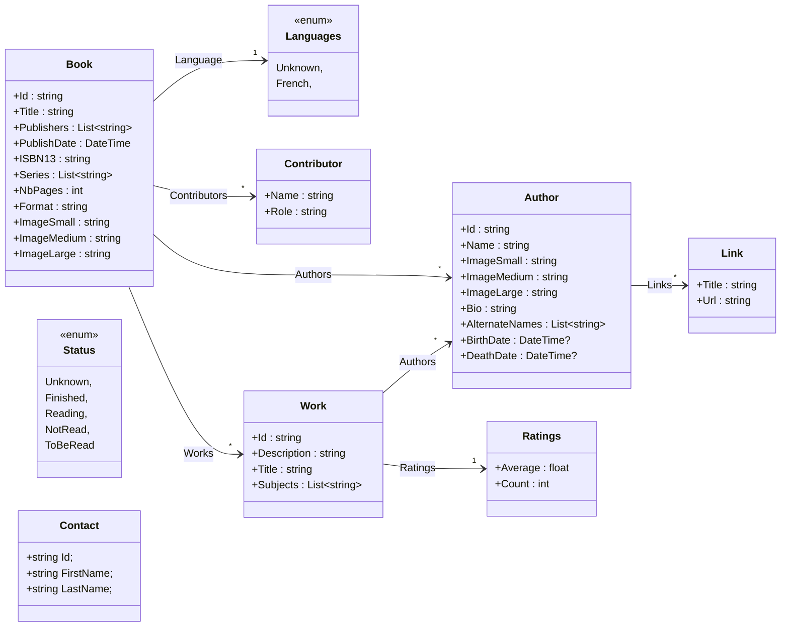
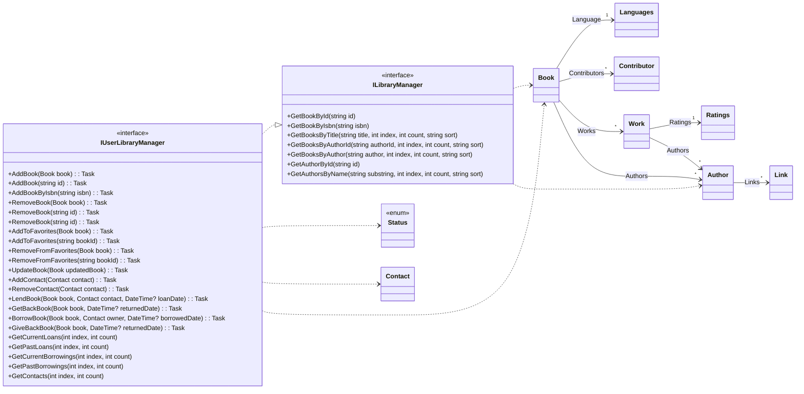

# PocketBook - Louis DUFOUR

## Informations projet
Application développer sous android API 28 pour ma part.

## Modèle

## Services & Interfaces

## Ressources 
- [Doc officielle MAUI](https://learn.microsoft.com/en-us/dotnet/maui/)
- [MAUI Community Toolkit](https://learn.microsoft.com/en-us/dotnet/communitytoolkit/maui/)
- [SF Symbols 5.0 (format SVG et PNG)](https://www.figma.com/file/7ATqS05m0VqE905x1NKS0D/SF-Symbols-5.0---5296-SVG-Icons-(Community)?type=design&node-id=5-1670&mode=design&t=75VRROmRWJsStAIv-0)
- [SF Symbols 5.0 (PNG only)](https://github.com/andrewtavis/sf-symbols-online/tree/master/glyphs)
  
